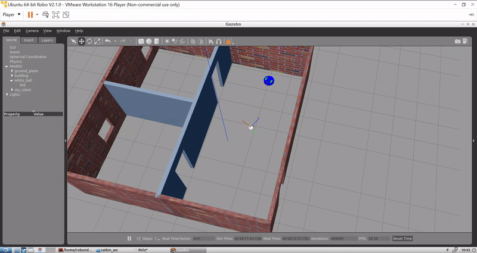

# FollowerRobot
A robot following a white ball in Gazebo Simulator using ROS. Done as a part of Robotics Nano Degree Course.

# Demo
A demo recording showing the robot following the white colored ball around
And the output from the camera and LIDAR sensor

